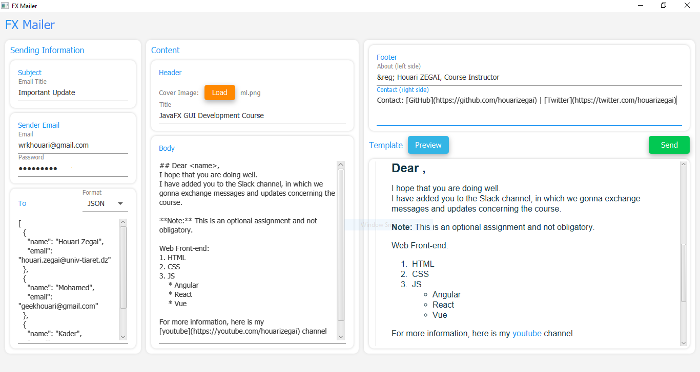
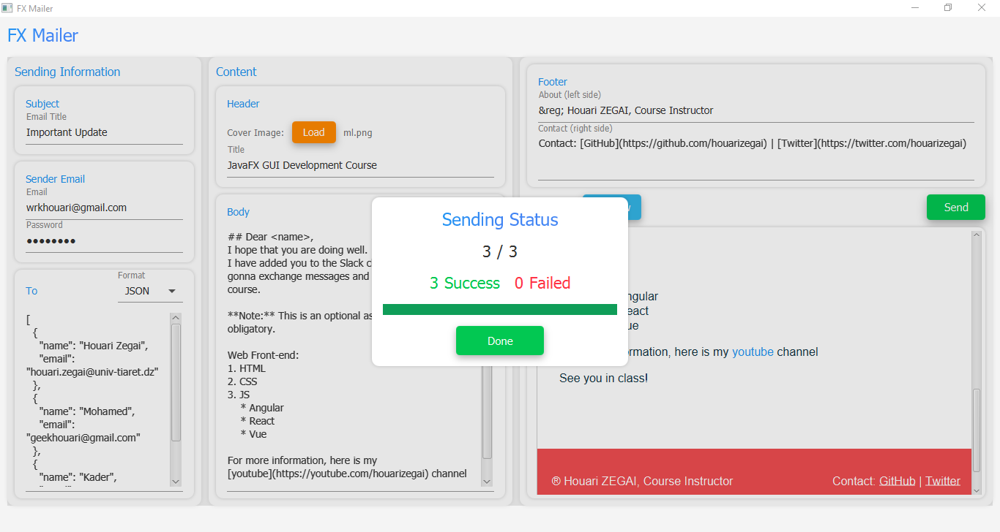

# FXMailer
Desktop application Tool. Allow you to send a beautiful html template to multiple email recipients with one click!

### Features
* [x] Easy to use
* [x] Send HTML template with images
* [x] Send Email to multiple receivers
* [x] Can Inject the name of receiver in template using this tag: \<name\>
* [x] Parse JSON data (emails + receiver name of each email)
* [x] Support Markdown syntax

### Screenshoots
Main App               |
|:---------------------:|
 |
Sending Status |
 |
Template (result)           |
 |

### Requirements
* Java version 8 (JDK 8)
* Maven
* Internet connection

### Libraries used
* JFoenix (Material design)
* FlexMark (Markdown Parser)
* Gson (JSON parser)
* Java Mail

### Technologies used
* JavaFX

### Installation
1. Download the repository files (project) from the download section or clone this project by typing in the bash the following command:

       git clone https://github.com/HouariZegai/FXMailer.git
2. Import it in Intellij IDEA or any other Java IDE and let Maven download the libraries used for you.
3. Run the application :D

### Contributing 💡
If you want to contribute to this project and make it better with new ideas, your pull request is very welcomed.
If you find any issue just put it in the repository issue section, thank you.

### Contact me
Email: houarizegai14@gmail.com
Sites: [LinkedIn](https://linkedin.com/in/houarizegai) | [Twitter](https://twitter.com/houarizegai)
